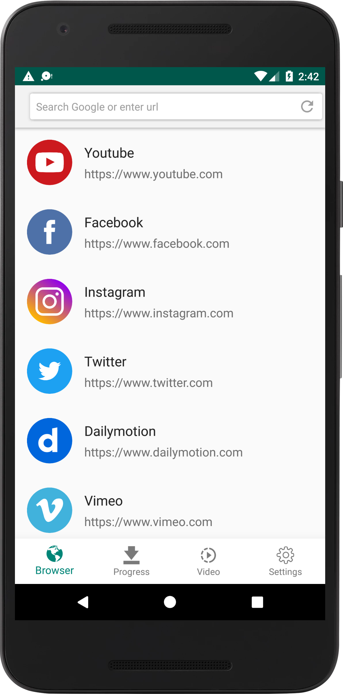
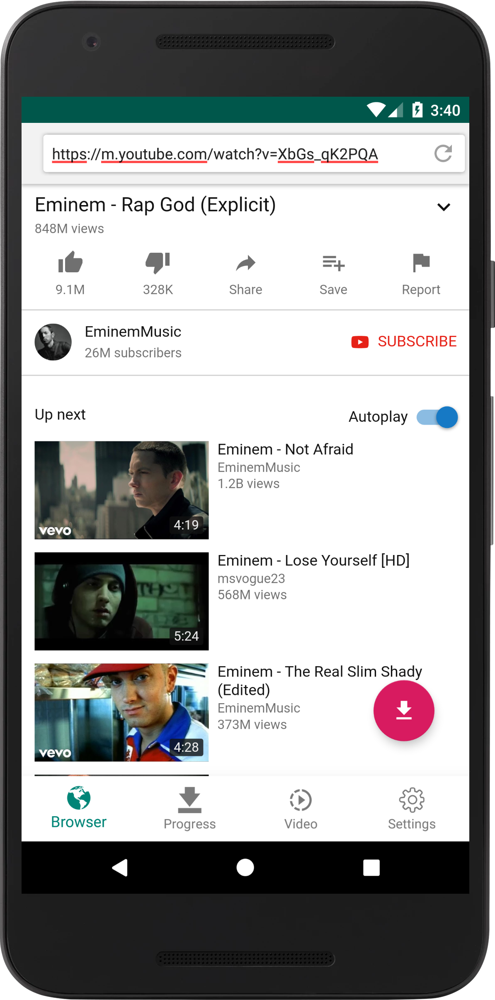
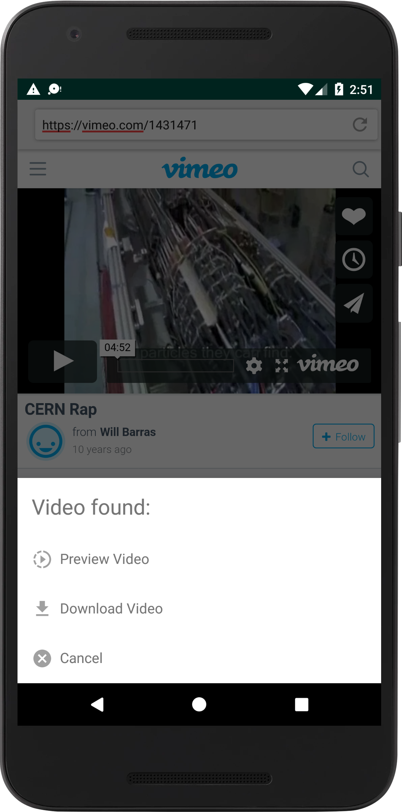
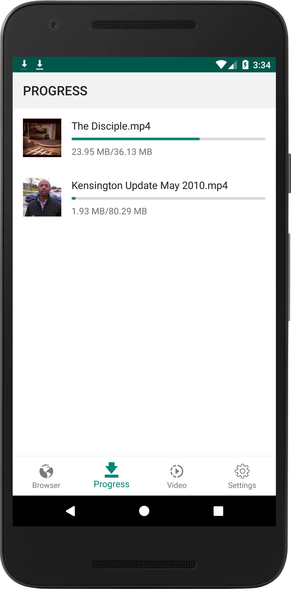
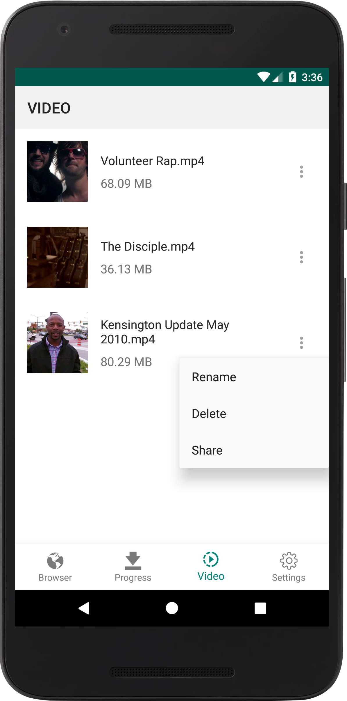

# youtube-dl-android

 

📦 An Android client for youtube-dl: https://github.com/rg3/youtube-dl

## Major technologies

- Language: Kotlin
- Architecture: MVVM
- Android architecture components: ViewModel, LiveData, Room
- Dependency injection: Dagger2
- Network: Retrofit, Okhttp
- Testing: JUnit, Espresso, Mockito
- Data layer with repository pattern and RxJava
- Continuous integration with [CircleCI](https://circleci.com/)
- Test report and coverage with [Coveralls](https://coveralls.io/)
- Run instrumented tests with [Firebase Test Lab](https://firebase.google.com/docs/test-lab/)

## Features

- Download videos from Youtube, Facebook, Twitter, Instagram, Dailymotion, Vimeo and more than [other 1000 sites](http://rg3.github.io/youtube-dl/supportedsites.html)
- Browse videos with the built-in browser
- Download videos with the built-in download manager
- Play videos offline with the built-in player
- Save your favorite videos online and watch them later without downloading them
- Save bookmark and history as a real browser

## Screenshots

    

## License

This package is licensed under the MIT license. See [LICENSE](./LICENSE) for details.
